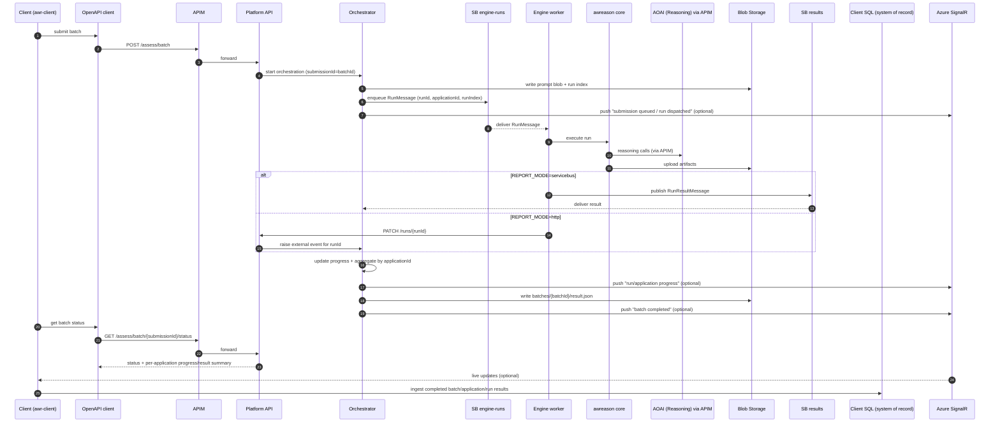

# AWR Platform Constitution

## Core Principles

### I. Zero-Trust Identity (NON-NEGOTIABLE)

All Azure resource access uses Microsoft Entra ID (formerly AAD) and Managed Identity exclusively. No SAS tokens, no connection strings with secrets, no key-based authentication. `DefaultAzureCredential` is the single credential provider for local dev (`az login`) and deployed workloads (system/user-assigned MI). RBAC role assignments govern all data-plane access.

### II. No Secrets in Code (NON-NEGOTIABLE)

No credentials, connection strings, resource IDs, or keys are permitted in source code, Terraform modules, or CI/CD pipelines. All sensitive values live in Azure Key Vault or are injected as environment variables at deploy time. Terraform uses variables for all resource identifiers. `.env_*` files are git-ignored.

### III. Infrastructure as Terraform

All Azure infrastructure is provisioned via Terraform >= 1.6 using modular compositions under `infra/terraform/`. No Azure CLI imperative provisioning in production paths. Modules support resource reuse (`reuse_*` flags) for shared enterprise resources. Remote state is stored in Azure Storage with per-environment state keys.

### IV. Test-First Development

Tests are written before implementation. The `tests/` directory contains pytest-based tests covering API routes, repository idempotency, SQL transient retry, and orchestration logic. Red-Green-Refactor is the expected cycle. CI (`ci.yml`) gates all PRs on lint (ruff), type-check (mypy), and test pass.

### V. Resilient by Default

All SQL operations use exponential backoff with full jitter (`runtime/transient.py`). Connections are re-opened before each retry. Only transient SQLState codes trigger retries. Service Bus consumers handle poison messages via DLQ with a replay mechanism. All operations are idempotent where possible.

### VI. Observability Everywhere

OpenTelemetry tracing, structured JSON logging, and metrics are mandatory for all services. Every HTTP request carries a `correlationId`. Application Insights and Log Analytics are the observability backends. Diagnostic strings are logged when latency exceeds thresholds or unexpected status codes are returned.

### VII. Simplicity & YAGNI

Start simple. No abstractions for hypothetical future requirements. No over-engineering. Features are driven by the PRD and spec documents. Complexity must be justified in writing. The right amount of code is the minimum needed for the current requirement.

## Security Requirements

- **Blob Storage**: SAS tokens are prohibited by security policy. Use Managed Identity with `Storage Blob Data Contributor` role.
- **SQL Access**: Passwordless via ODBC Driver 18 `attrs_before[1256]` token injection. No SQL auth usernames/passwords.
- **API Auth**: Optional AAD JWT enforcement via `AUTH_REQUIRED` toggle. Admin endpoints protected when enabled.
- **APIM Gateway**: Rate limiting, subscription keys, header redaction, and correlation-id pass-through enforced at the gateway.
- **Private Endpoints**: Toggleable per environment for SQL, APIM, and other services via `use_private_endpoints` variable.
- **CI/CD**: OIDC-based federation to Azure from GitHub Actions. No client secrets stored in GitHub.

## Technology Stack

| Layer | Technology | Version/Constraint |
| ----- | ---------- | ------------------ |
| Language | Python | >= 3.11 |
| API Framework | FastAPI + Uvicorn | Latest stable |
| Models/Config | Pydantic v2 + pydantic-settings | >= 2.0 |
| Database Driver | pyodbc + ODBC Driver 18 | >= 5.0 |
| Identity | azure-identity (DefaultAzureCredential) | >= 1.16 |
| Messaging | azure-servicebus | >= 7.12 |
| Orchestration | Azure Durable Functions | >= 1.2 |
| Observability | OpenTelemetry + Azure Monitor | >= 1.24 |
| Migrations | Alembic | >= 1.13 |
| IaC | Terraform (azurerm, azuread, random) | >= 1.6 |
| Linting | ruff | >= 0.4 |
| Type Checking | mypy (strict) | >= 1.10 |
| Testing | pytest + pytest-asyncio | >= 8.0 |
| Target Platform | Azure (App Service / Container Apps) | All resources on Azure |

## Development Workflow

1. **Virtual Environment**: Always activate `.venv` before running any Python scripts.
2. **Branch Strategy**: Feature branches from `main`; PRs require CI pass + review.
3. **Versioning**: Every deployment version includes a full date-time stamp.
4. **Default Shell**: Git Bash (even on Windows).
5. **Dependencies**: Maintain `requirements.txt` alongside `pyproject.toml`. Use latest GA Azure API versions.
6. **Environment Config**: `.env_local` (dev), `.env_qa` (test), `.env_prod` (production). All git-ignored.
7. **Resource Reuse**: Enterprise shared resources (Log Analytics, APIM, SQL) can be reused via `*_REUSE` flags without changing module interfaces.
8. **Code Review**: All PRs must verify compliance with this constitution. Terraform plans are posted as PR comments.

## Communication Flow

The following golden thread is **mode-aware** and distinguishes authoritative
state from live projections. Sequential low-volume scoring may bypass the
platform entirely; the flow below applies to the platform-mediated high-volume
queue-worker path.

- **Business system of record**: the client repo owns persistence of batches,
    runs, and aggregated business results in its own `talentmatch` schema.
- **In-flight orchestration state**: the platform owns active submission state
    in Durable Functions. `submissionId = batchId = instance_id` for the lifetime
    of the orchestration.
- **Operational routing state**: the platform maintains a run index that maps
    `runId -> batchId + applicationId + runIndex` so that engine callbacks and
    result messages can be routed back to the correct submission.
- **Completed handoff state**: the platform persists completed batch results to
    blob storage as `batches/{batchId}/result.json`; the client may ingest those
    results into its own store on its own schedule.
- **Live progress projection**: Azure SignalR may be used to push non-authoritative
    progress, state, and asset events to subscribed clients. SignalR events are a
    projection of authoritative platform/client state, not a replacement for it,
    and must be reproducible from Durable state, the run index, result documents,
    and telemetry.

Every implementation must preserve end-to-end traceability across
`submissionId`, `batchId`, `jobId`, `applicationId`, `runId`, `runIndex`,
`correlationId`, and W3C `traceparent`.

## Governance

This constitution supersedes all other development practices for the AWR Platform repository. Amendments require:

1. A documented rationale in a PR description.
2. Approval from the Platform Team lead.
3. A migration plan for any breaking changes to existing modules.

All code reviews must verify compliance. Violations must be flagged and resolved before merge.

**Version**: 1.1.0 | **Ratified**: 2026-03-02 | **Last Amended**: 2026-05-22
